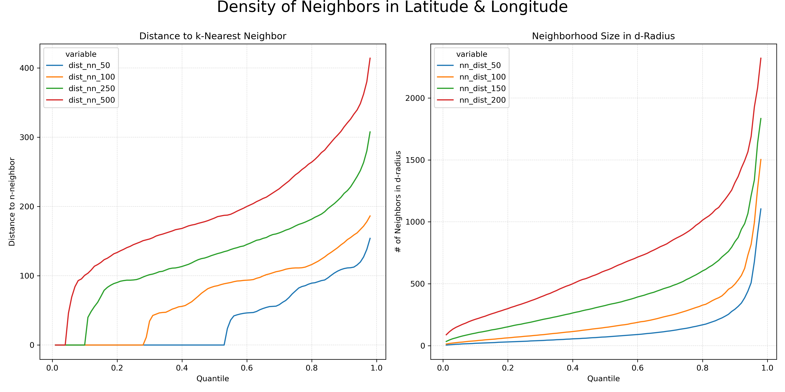

# Large Dataset Clustering - Crime Hotspots in Brooklyn

The purpose of this project was to address two common challenges in clustering analysis, specifically unsupervised learning: handling large datasets and performing spatial and temporal clustering. To accomplish this, I selected a dataset from the [NYC Open Data repository](https://data.cityofnewyork.us/) and developed a model to identify crime hotspots in Brooklyn using the [BIRCHSCAN procedure](https://www.sciencedirect.com/science/article/abs/pii/S0957417421009283).

Crime hotspot detection is a [well-defined problem in data-driven policing](https://www.sciencedirect.com/science/article/abs/pii/S0957417421009283), and there are many existing approaches for identifying crime hotspots. In this analysis, I will focus on building a solution for identifying street-level crime hotspots in Brooklyn using the BIRCHSCAN algorithm. The BIRCHSCAN algorithm is a scalable and efficient clustering method that is well-suited for large datasets.

## Libraries

1. `pandas` & `numpy` - data manipulation and analysis;
1. `sklearn` - machine learning;
1. `matplotlib` & `seaborn` - data visualization;
1. `osmnx` - street network analysis.

## Dataset

The dataset used for this project was obtained from the NYC Open Data repository. It includes crime incident reports with details such as date, time, location, type of crime, victimology. The dataset was preprocessed to include only **felonies** that occurred in **Brooklyn** between 2000 & 2022, which resulted in a dataset of 751,972 rows.

## Methodology

1. Outlier cleaning (threshold-based);
1. Feature engineering, especifically the creation of a new feature `time_meters` based on neighborhood-distance evaluations, allowing the use of both temporal and spatial features in hotspot detection;
1. BIRCHSCAN clustering algorithm;
1. Visualization and analysis of results using `osmnx` and `matplotlib`.

## Results

On first evaluation, we can clearly see the neighborhood-level crime hotspots in Brooklyn, which are consistent with the results of previous studies.

There are two key problems when attempting to cluster a dataset such as this one:

1. The dataset is too large to be clustered using traditional methods;
1. The temporal dimensions is often ignored (or, at most, included as filtering criteria).

The first issue is a technical one and can be solved in a variety of manners. In this project, I used the BIRCHSCAN algorithm, which is a scalable and efficient clustering method that is well-suited for large datasets. The second issue is more complex and requires a more creative approach. 

We first must consider the **distance distribution** of different crimes in our dataset. This is a traditional step when utilizing density-based algorithms, such as DBSCAN - it is often used to estimate the hyperparameter $\epsilon$. In this case, however, we will use it to create a new feature, `time_meters`, which map the temporal dimension of our dataset to the spatial dimension. This allows us to use both temporal and spatial features in our clustering algorithm, detcting hotspots as they begin, evolve and end. 

We will begin by investigating the distance distribution of different neighborhood sizes using only the latitude and longitude features of our dataset.

## Conclusion

In conclusion, this project demonstrates the use of the BIRCHSCAN algorithm to efficiently identify crime hotspots in Brooklyn using a large and complex dataset that includes both geographical and temporal dimensions. The results provide valuable insights into the spatial and temporal distribution of crime in the borough, which can inform decision-making and resource allocation for law enforcement and community leaders.

## References

1. https://data.cityofnewyork.us/Public-Safety/NYPD-Complaint-Data-Historic/qgea-i56i
1. https://www.ojp.gov/pdffiles1/nij/209393.pdf
1. https://www.sciencedirect.com/science/article/abs/pii/S0957417421009283
1. https://www.sciencedirect.com/science/article/pii/S1877050916315824