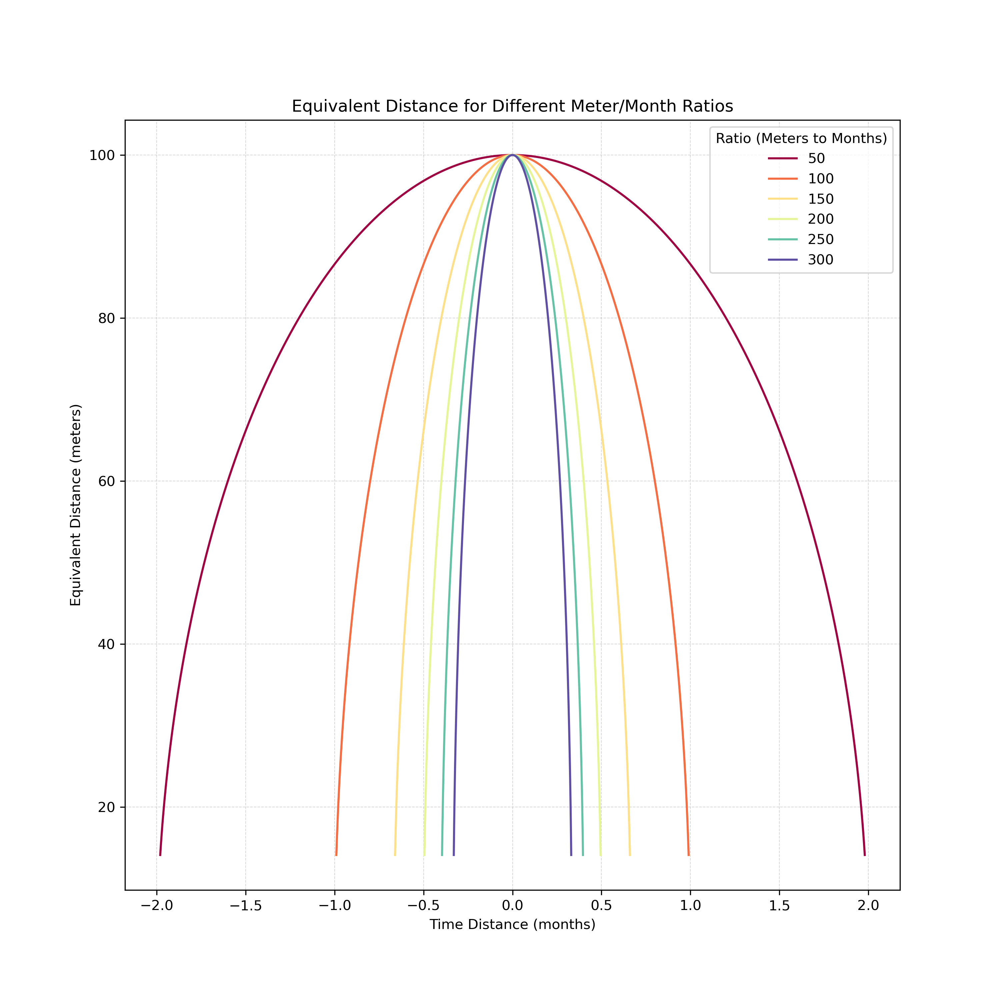
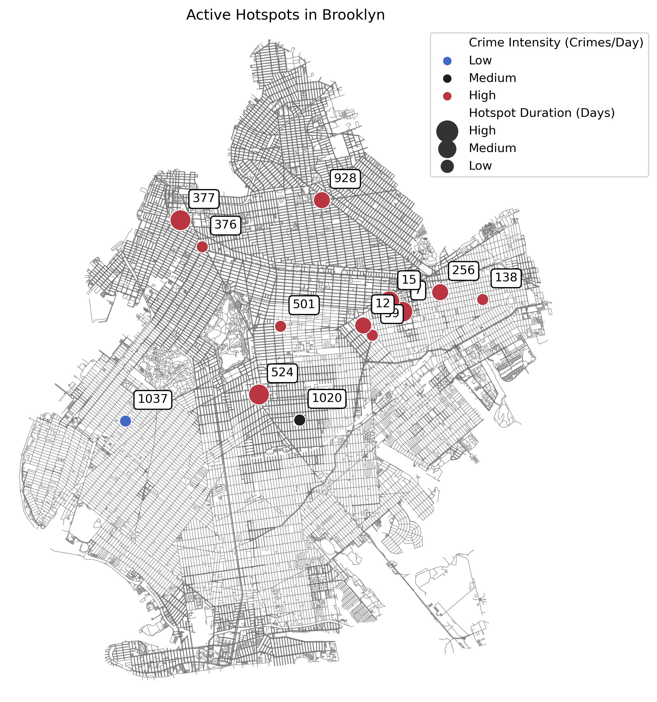

# Large Dataset Clustering - Crime Hotspots in Brooklyn

The purpose of this project was to address two common challenges in clustering analysis, specifically unsupervised learning: handling large datasets and performing spatial and temporal clustering. To accomplish this, I selected a dataset from the [NYC Open Data repository](https://data.cityofnewyork.us/) and developed a model to identify crime hotspots in Brooklyn using the [BIRCHSCAN procedure](https://www.sciencedirect.com/science/article/abs/pii/S0957417421009283).

Crime hotspot detection is a [well-defined problem in data-driven policing](https://www.sciencedirect.com/science/article/abs/pii/S0957417421009283), and there are many existing approaches for identifying crime hotspots. In this analysis, I will focus on building a solution for identifying street-level crime hotspots in Brooklyn using the BIRCHSCAN algorithm. The BIRCHSCAN algorithm is a scalable and efficient clustering method that is well-suited for large datasets.

## Libraries

1. `pandas` & `numpy` - data manipulation and analysis;
1. `sklearn` - machine learning;
1. `matplotlib` & `seaborn` - data visualization;
1. `osmnx` - street network analysis.

## Dataset

The dataset used for this project was obtained from the NYC Open Data repository. It includes crime incident reports with details such as date, time, location, type of crime, victimology. The dataset was preprocessed to include only **felonies** that occurred in **Brooklyn** between 2000 & 2022, which resulted in a dataset of 751,972 rows.

## Conclusion

In conclusion, this project demonstrates the use of the BIRCHSCAN algorithm to efficiently identify crime hotspots in Brooklyn using a large and complex dataset that includes both geographical and temporal dimensions. The results provide valuable insights into the spatial and temporal distribution of crime in the borough, which can inform decision-making and resource allocation for law enforcement and community leaders.

## Methodology

1. Outlier cleaning (threshold-based);
1. Feature engineering, especifically the creation of a new feature `time_meters` based on neighborhood-distance evaluations, allowing the use of both temporal and spatial features in hotspot detection;
1. BIRCHSCAN clustering algorithm;
1. Visualization and analysis of results using `osmnx` and `matplotlib`.

On first evaluation, I can clearly see the neighborhood-level crime hotspots in Brooklyn, which are consistent with the results of previous studies.

#

There are two key problems when attempting to cluster a dataset such as this one:

1. The dataset is too large to be clustered using traditional methods;
1. The temporal dimensions is often ignored (or, at most, included as filtering criteria).

The first issue is a technical one and can be solved in a variety of manners. In this project, I used the BIRCHSCAN algorithm, which is a scalable and efficient clustering method that is well-suited for large datasets. The second issue is more complex and requires a more creative approach. 

I first considered the **distance distribution** of different crimes in our dataset. This is a traditional step when utilizing density-based algorithms, such as DBSCAN - it is often used to estimate the hyperparameter $\epsilon$. In this case, however, I will use it to create a new feature, `time_meters`, which map the temporal dimension of our dataset to the spatial dimension. This allows us to use both temporal and spatial features in our clustering algorithm, detecting hotspots as they begin, evolve and end. 

I will begin by investigating the distance distribution of different neighborhood sizes using only the latitude and longitude features of our dataset.

The distribution above clearly shows the impact of utilizing such a long period without adding *time* as a dimension: on small neighborhoods (50-nearest neighbors), over 50% of points have **distance close to zero**! This is a clear indication that the temporal dimension is important and should be included in our analysis.

To do so, I created a transformation which represents time and space in the same measure. I opted, in this case, for a simple linear transformation, represented by the `meter_month_ratio` parameter. A simple of undarstanding this parameters is as *conversion unit* from **months** to **meters**: with `meter_month_ratio = 100`, two crimes ocurring at the same time 100m apart are the same distance apart as two crimes ocurring 1 month apart at the same location. We can visualize this equivalence in the figure below.

The higher the `meter_month_ratio`, the more important the temporal dimension is in our clustering algorithm. The determination of this parameters is a complex task and should be done in a case-by-case basis: setting it too high will results in clusters being *tight* in time (crimes that happen at the same time) but *loose* in space (dispersed over location) while setting it too low will results in a failure to detect a hotspot's movement over time. Automating this process is a complex task and is out of the scope of this project - especially as it interacts directly with the clustering hyperparameters ($\epsilon$, $\theta$ and $minSamp$).

Through empirical investigation I determined that for street-level hotspots a meter-to-month ratio of **50** was good. I utilized the same distance distribution as before to evaluate the new distribution of distances after the transformation.

To create a large number of small clusters (street-level hotspots according to the literature), I will use a small ($minSamp = 50$, the DBSCAN neighboorhood size). I selected the $\epsilon$ parameter based on the spatio-temporal distance density function: the definition of street-level hotspots means leads to a clustering solution with many outliers (most crimes won't be inside a hotspot). I started the investigation at $\epsilon = 200$ and decresed it to 190 based on final cluster sizes. At this point in our distance density function only **~10%** of datapoints are within $\epsilon$ of its $minSamp$ neighbors.

The first step in the BIRCHSCAN procedure is the differential sampling of the dataset using the BIRCH algorithm. The graph below illustrates the results of this step - which resulted in a dataset with 26% of original observations.

The second step is the clustering of the sampled dataset (with associated weights) using the DBSCAN algorithm. The graph below illustrates the final clustering results.

## Results

As expected, the number of detected hotspots is high - over 1000 for the 20 years of data. This is a consequence of the small $\epsilon$ parameter used in the DBSCAN algorithm. Let's investigate these hotspots based on their location, their duration and the number of crimes commited inside them. Let's start by looking at the joint distribution of duration (days) and intensity (crime/day):

The graph above (a log-log plot) shows there is a clear relationship between duration and intensity: **a 10% increase in duration led to a 4.35% increase in intensity**. This does not imply causality to this relation, however, as it is possible that the intensity of a hotspot is the cause of its duration (and not the other way around). Either way, this correlation indicates that longer duration hotspots are more violent, and could be a good indicator of a connection between micro (street-level) and macro (neighborhood-level) hotspots.

To further investigate this we can look at the geographical distribution of hotspots classified by duration.

There is no clear indication that some areas have a higher incidence of long-duration hotspots, although further investigation would be warranted (using more rigorous methods, considering not only location, but evolution over time).

For a more direct application, we can look at the geographical distribution of active hotspots: hotspots whose last crime was observed in the last 7 days (considering the last day available in the database).

Furthermore, we can investigate the trajectory of specific hotspots over time:

## References

1. https://data.cityofnewyork.us/Public-Safety/NYPD-Complaint-Data-Historic/qgea-i56i
1. https://www.ojp.gov/pdffiles1/nij/209393.pdf
1. https://www.sciencedirect.com/science/article/abs/pii/S0957417421009283
1. https://www.sciencedirect.com/science/article/pii/S1877050916315824
